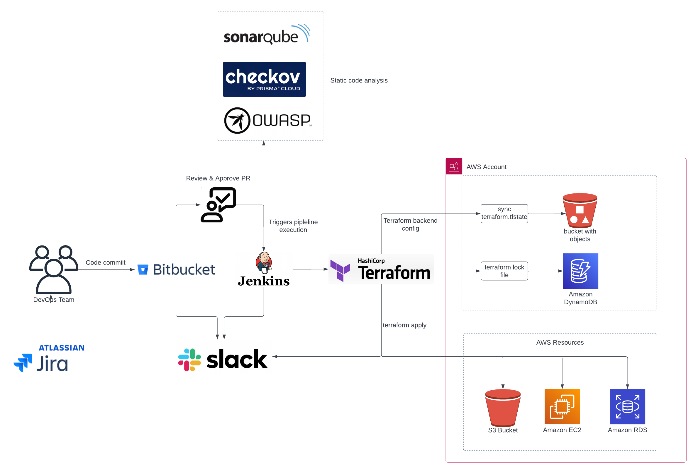

# CI/CD Pipline using Jenkins and Terraform

This Jenkins pipeline automates the deployment of Terraform infrastructure, incorporating security checks and reporting.

## Prerequisites

- **Jenkins Setup:**
  Ensure Jenkins is properly configured with necessary plugins and agents.

- **AWS Credentials:**
  Set up AWS credentials with appropriate permissions and configure them in Jenkins.

- **Terraform Configuration:**
  Maintain Terraform configurations in your repository, organized by workspaces for development and production.

- **SonarQube Integration:**
  Integrate with SonarQube for static code analysis. Provide SonarQube token in Jenkins credentials.

- **OWASP Dependency-Check:**
  Integrate OWASP Dependency-Check for identifying vulnerabilities in project dependencies.

## Pipeline Stages

1. **Checkout:**
    Fetch the code from the version control system.

2. **Install Checkov:**
   Install Checkov tool for infrastructure as code (IAC) security scanning.

3. **Terraform Init:**
   Initialize Terraform and answer "yes" to state migration prompts.

4. **Terraform Workspace:**
   Select the appropriate Terraform workspace based on the Git branch.

5. **OWASP Dependency-Check:**
   Scan for vulnerabilities using OWASP Dependency-Check.

6. **SonarQube Analysis:**
   Perform static code analysis using SonarQube.

7. **Checkov Scan:**
   Run Checkov to scan for security issues in Terraform code.

8. **Terraform Plan:**
   Generate Terraform plan without applying.

9. **Manual Approval:**
   Pause the pipeline for manual approval before Terraform apply.

10. **Terraform Apply:**
    Apply approved Terrafrom changes to AWS infrastructure.

## Post-Build Actions

- **Slack Notifications:**
  Receive notifications on Slack for build completion, failure, instability, and abortion.

## Usage

- Configure Jenkins environment variables, AWS credentials, and SonarQube token.
- Maintain Terraform configurations in the repository.
- Adjust Terraform workspaces based on branch names in Jenkinsfile.
- Customize Slack channel and notifications as needed.
